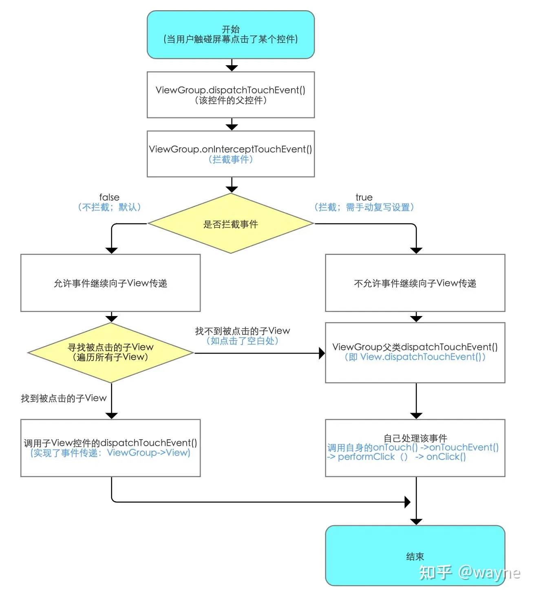
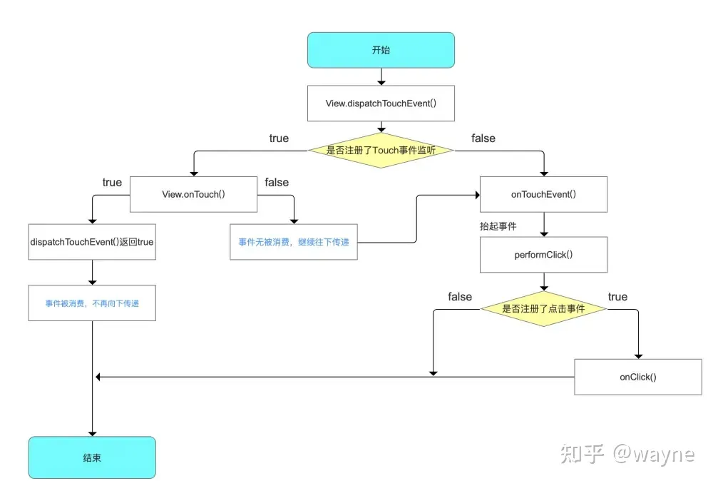

# 触摸事件分发机制

**参考：[Android事件分发机制详解：史上最全面、最易懂](https://www.jianshu.com/p/38015afcdb58)**

Android事件分发的对象主要包括Activity、ViewGroup、View三个层级。

常见的事件类型有三种：ACTION_DOWN、ACTION_MOVE、ACTION_UP

事件分发的主要方法有：

- dispatchTouchEvent()：负责分发事件，通常不需要重写。
- onInterceptTouchEvent()：仅存在于ViewGroup中，用于判断是否拦截事件。默认返回false，即不拦截。
- onTouchEvent()：负责处理触摸事件，返回true表示消费事件，返回false表示不消费。

## ViewGroup事件分发：

### **如何解决滑动冲突**

滑动冲突是指当两个或多个视图（View）具有相同或不同方向的滑动能力时，可能出现的滑动行为不符合预期的情况。

解决滑动冲突的基本思路是：明确哪个视图应该处理哪些滑动事件，然后通过拦截或不拦截事件来实现。

解决滑动冲突的方法有两种：外部拦截法和内部拦截法。

- 外部拦截法：指在父视图（ViewGroup）的onInterceptTouchEvent()方法中根据滑动方向和条件来判断是否拦截事件，然后交给自己或子视图的onTouchEvent()方法处理。
- 内部拦截法：指在子视图（View）的onTouchEvent()方法中根据滑动方向和条件来判断是否处理事件，如果不处理则调用父视图（ViewGroup）的requestDisallowInterceptTouchEvent()方法来请求父视图不要拦截事件。
